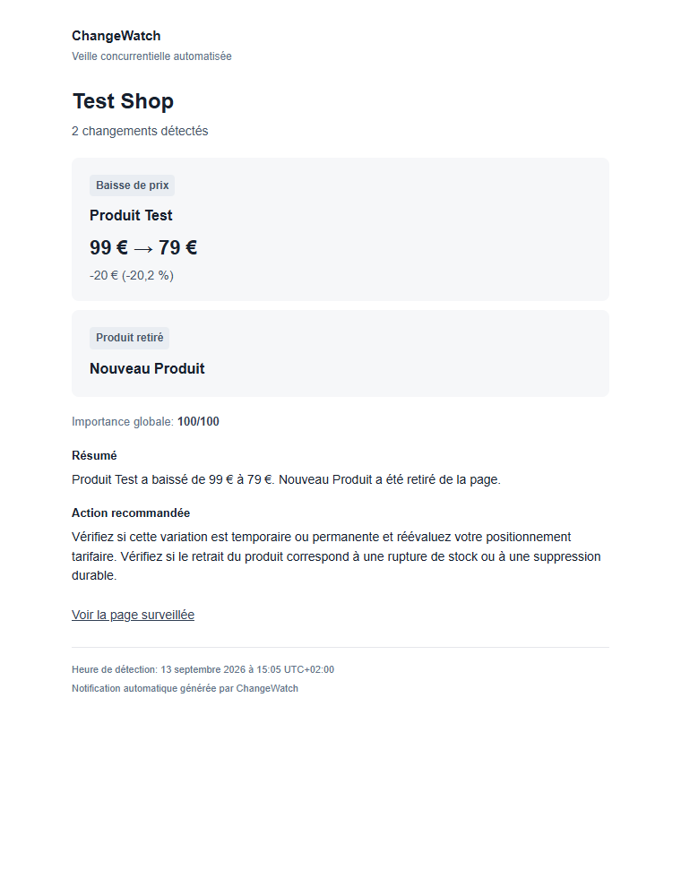

# ChangeWatch-as-a-Service

A Python Apify Actor for competitor page monitoring: URL → normalized snapshot → comparison → deterministic importance score → structured Dataset result. No external AI service is required.

## Collection Coverage v1

Collections expand automatically from the supplied URL using HTML HTTP requests. Discovery prioritizes `rel="next"` and English/French next/load-more labels, then explicit numeric `page`, `p`, `pageNumber` query links or `/page/2` paths. Direct `data-next-url` / `data-load-more-url` attributes and labelled controls with `data-url` can supply additional HTML URLs. Only links present in the fetched HTML on the same origin are candidates. URL patterns are never invented; JSON APIs, arbitrary JavaScript execution, private API reverse engineering and anti-bot bypass are unsupported.

Internal limits per configured URL are **10 pages including the initial page, 500 unique entities, 25 MB decompressed content and a 90-second collection time budget**. The existing 5 MB per-response limit still applies. Extra pages use one attempt; their failure stops expansion without discarding earlier successful pages. Expansion also stops on repeated content/next URL or no new entity identities. These defaults require no Task input changes. The original root fetch retains its retry behavior within the collection time budget.

Entities are merged by the existing ID → product URL → normalized title → context hierarchy. Conflicting duplicate offers have their price interpretation disabled. Collection product text is sorted by identity, keeping first-page commercial copy outside product containers and pagination; changing product page/DOM order does not produce product additions/removals. Additional-page non-product banners are not aggregated. Single-product pages without pagination keep their original comparison behavior.

Dataset diagnostics:

| Field | Meaning |
| --- | --- |
| `collection_detected` | Multiple extracted entities or a pagination/load-more signal was found. |
| `collection_pages_fetched` | Successfully fetched/extracted HTML pages, including a fetched repeat. |
| `collection_entities_found` | Unique observed products retained within the cap; not the site's advertised total. |
| `collection_expansion_status` | `not_applicable`, `complete`, `partial`, `unsupported`, `limited`, or `error`. |
| `collection_expansion_reason` | Readable stopping/coverage diagnostic. |
| `collection_removals_suppressed` | Previously known entities retained because current removal coverage is unconfirmed. |
| `collection_baseline_preserved` | The last accepted collection snapshot was retained rather than overwritten. |

`complete` means all **discoverable HTML pagination** was exhausted, not that every product on the website is guaranteed covered. An unlinked hidden backend cannot be inferred. A visible JS-only load-more control without a usable URL reports `unsupported`; a page with no pagination signals reports the observed HTML frontier only. Limits report `limited`, extra-page failures/repeats report `partial`, and initial fetch failure reports `error` and preserves the good snapshot.

Incomplete scans keep observed entities and can still detect confident price changes in them. Missing old entities are retained for comparison, so a 300-product baseline followed by 24 products after an expansion failure cannot emit 276 removals. The last good snapshot stays intact, while pending/dedup/health diagnostics persist. Even an apparently successful scan with fewer pages **and** fewer products is treated conservatively as partial. This may miss a real removal when the final pagination page disappears; review at source before resetting. Initial partial coverage can establish a partial baseline; its first complete scan reinitializes rather than calling newly covered products new offerings.

Existing schema-1/2 snapshots remain readable. The first transition from a single-response snapshot to collection scope establishes an aggregated baseline with `collection_migrated: true` and no alert. This deliberately skips interpretation across the scope change. Subsequent complete scans compare aggregated snapshots. The schema version and named KVS stay unchanged; preserve snapshot and monitor records. No browser package or new dependency is required.

## Weekly monitoring activity report

Normal scheduled runs now maintain one `weekly-<hash of client ID>` record in `changewatch-snapshots-v1`. On first upgraded observation, a seven-day UTC window starts; existing run history is not backfilled. Once the window closes, a report is eligible **only if no significant client alert was successfully sent during that window** and `client_email` is configured. Weeks containing accepted change-alert sends skip the activity email. There are no daily no-change emails, and change alerts keep their existing gates and format.

The last configured URL's normal Dataset publication evaluates delivery once per run. No additional scheduler is needed: with daily runs, the first report normally arrives on the run at/after day seven. Report dates use the client's language and timezone; window boundaries remain ISO UTC in storage/Dataset. Seven days means elapsed time, so daylight-saving transitions may shift local boundary time. Long schedule gaps do not fabricate missing checks or send a backlog of empty weekly reports.

Both plain text and inline-styled HTML show the reporting period, unique configured URLs actually checked in that period, attempted check count (including failures), latest per-URL health observed during the period and significant alerts **sent**. A collection counts as one monitored URL/check regardless of expansion page count. Degraded/failing URLs and partial coverage are listed clearly. Failed qualifying alert delivery is not described as “nothing changed”; minor/suppressed changes may also have occurred. This is activity evidence, not proof that every site was continuously reachable.

Per-client state stores `last_weekly_report_at`, `period_start`, `period_end`, `checks_count`, `client_alerts_sent_in_period`, `healthy_urls`, `degraded_urls`, `failing_urls` and a frozen pending period for retries. Dataset items retain their existing fields and add `weekly_report_eligible`, `weekly_report_sent`, `weekly_report_period_start`, `weekly_report_period_end`, `weekly_report_checks_count`, `weekly_report_alerts_count`, `weekly_report_error`. They describe client-level activity, not a separate report per competitor. Only the final URL item can mark a report sent.

Missing recipient/configuration or provider failure never fails monitoring. One pending period is retained for a later normal-run retry; successful sends clear it, and a late retry cannot cause another report less than seven days later. Exactly-once delivery cannot be guaranteed across a provider acceptance followed by storage failure or overlapping Actor runs. Weekly requests include a deterministic period-specific idempotency key; [Resend retains those keys for 24 hours](https://resend.com/docs/dashboard/emails/idempotency-keys). Uncertain sends are held for operator review after 23 hours from the first attempt; inspect provider acceptance before allowing another attempt outside that window. Keep one non-overlapping Task/schedule per client. Changing recipient/language during an uncertain retry can conflict with a previously accepted idempotent payload; resolve it with the operator runbook.

### Pre-launch rebuild and live acceptance

1. In the existing Apify Actor, retain Git source `main` at the repository root and build the release commit. Keep the named KVS, existing Task inputs, Resend secrets and verified sender. No new credentials or input fields are required. Ensure Task build selection uses the new successful build before resuming daily schedules.
2. Use an operator-controlled, publicly reachable **three-page HTML collection fixture**: 24 products on page 1, 24 on page 2 and 12 on page 3, linked with `rel="next"`; each product has stable `data-sku`, title and one EUR price. Use a dedicated client ID `launch-collection-test`, an internal recipient, threshold 60 and Europe/Paris. Run once: initialized, 3 pages, 60 entities, complete, no alert.
3. Change a page-3 product from 99 EUR to 79 EUR and run: expect exactly that price event and one normal alert. Repeat unchanged: no repeat alert. Move an unchanged product between pages: no product event. Add then remove a product on page 3 in separate runs: corresponding entity events (email remains subject to score/confirmation).
4. Make page 2 return 403 and run: partial, 24 observed entities, 36 suppressed removals, preserved good snapshot and no mass-removal email. Restore it and verify complete coverage. Replace pagination with a JS-only `<button>Load more</button>`: expect unsupported/partial diagnostics rather than a claim of full coverage.
5. For weekly acceptance, create a separate quiet test client with five controlled static URLs and an internal recipient. Initialize and run daily for seven elapsed days: expect 35 checks in the first closed period, zero accepted significant alerts and exactly one activity email on the next boundary run. Re-run immediately: no duplicate. Include a persistently failing URL in a separate trial to verify health wording. Use a third client with a real accepted price alert to verify that its closed week sends no redundant activity report.
6. For a same-day weekly test **only on the isolated test client**, pause its schedule, finish all runs, export its `weekly-*` record, and change just its `period_start`/`period_end` to an elapsed seven-day interval. Retain genuine observed counters; never inflate them. Run once with the internal recipient, then rerun to check deduplication. This tests eligibility/delivery, not seven days of actual monitoring. Delete the isolated test state under policy or restore the exported pre-test record only with delivery disabled to avoid duplicate test mail. Never adjust production period dates to manufacture activity.

Local mocked tests validate these behaviors; they do not establish live Apify delivery or target-site coverage. See the [operator runbook](docs/OPERATOR_RUNBOOK.md) for diagnosis and recovery.

## Operating ChangeWatch for customers

Use one saved Apify Task per customer, named `changewatch-<client_id>`, and one daily schedule targeting that Task. The standard input contract is `client_id`, `client_email`, `language`, `timezone`, `alert_threshold` and `competitors`. Client IDs must be unique, permanent lowercase ASCII kebab-case (up to 200 characters). Noncanonical IDs are rejected rather than silently normalized; existing noncanonical IDs require an explicit transition to a verified unused ID and a fresh baseline. Valid existing IDs retain their snapshots.

- [Client onboarding and URL/contact change procedures](docs/CLIENT_ONBOARDING.md): five-minute operator setup checklist, canonical input and defaults.
- [Operator runbook](docs/OPERATOR_RUNBOOK.md): failures, delivery, single-URL resets and weekly review.
- [Seven-day trial workflow](docs/TRIAL_WORKFLOW.md): honest monitoring evidence and paid continuation.
- [Client offboarding](docs/CLIENT_OFFBOARDING.md): stop triggers and handle client-scoped storage under the agreed policy.
- [Starter configuration: 5 URLs](examples/client-starter.json) and [Business configuration: 15 URLs](examples/client-business.json): reserved example domains; replace them before running.
- Manual templates: [welcome FR](docs/templates/welcome-fr.txt), [welcome EN](docs/templates/welcome-en.txt), [monitoring active FR](docs/templates/monitoring-active-fr.txt), [monitoring active EN](docs/templates/monitoring-active-en.txt). Replace every `{{placeholder}}`, verify facts and send manually only after successful activation.

Default policy: daily monitoring, threshold 60, Europe/Paris for French customers, automatic confirmation, 24-hour identical-alert cooldown, and internal notifications when `OPERATOR_EMAIL` is configured with a working email provider. Five minutes is an operator setup target, not a guarantee that all initial fetches finish within five minutes.

ChangeWatch monitors public URLs supplied by customers/operators. Continued scrapeability is not guaranteed. Product disappearance is not proof of discontinuation, and alerts are monitoring signals rather than guaranteed business facts. Customers should verify material decisions at source. These are product boundaries, not a legal retention policy.

## Deploy on Apify

1. Create an Actor in Apify Console and choose **Git repository** in Source.
2. Use `https://github.com/KOMELF-coder/changewatch-as-a-service.git`, branch `main`, repository root. Authorize GitHub access if private.
3. Build. `.actor/actor.json` points to the Dockerfile and input schema. The container uses Python 3.12 and runs `python -m src`.
4. Start with 256–512 MB memory and a run timeout appropriate for the page count (up to approximately 185 seconds per page with all retries).
5. Enter input and run. Inspect the run Dataset and named `changewatch-snapshots-v1` Key-Value Store.

The input UI provides a Client ID and individually editable competitor name/URL entries. Replace the illustrative example URL with a real page; example.com/pricing may return 404.

## Input

```json
{
  "client_id": "demo-client",
  "alert_threshold": 60,
  "language": "en",
  "competitors": [
    {"name": "Competitor A", "url": "https://example.com/pricing"}
  ]
}
```

Supply 1–100 distinct HTTP(S) URLs. Client IDs must be lowercase kebab-case and at most 200 characters; competitor names must be nonempty and at most 200 characters. URLs may contain at most 2,048 characters without credentials. Invalid input fails before processing. Fragments/default ports are removed and hostnames lowercased. Paths/query strings remain significant. Duplicate canonical URLs are rejected.

## Output

One result per page: `initialized`, `unchanged`, `changed`, or `error`. Fetch failures preserve the previous snapshot. An error's `changed: false` is not evidence of unchanged content. All fetches failing marks the run failed after writing error records; mixed runs complete, so inspect individual statuses.

Example comparing `Monthly plan price $10` with `Monthly plan price $20` (hashes abbreviated):

```json
{
  "client_id": "demo-client",
  "competitor": "Competitor A",
  "url": "https://example.com/pricing",
  "status": "changed",
  "changed": true,
  "importance_score": 90,
  "change_summary": "1 text change(s); concepts: pricing, subscription. Before: $10. After: $20.",
  "previous_hash": "sha256-of-previous-text",
  "current_hash": "sha256-of-current-text",
  "detected_at": "2026-09-11T12:00:00+00:00",
  "snapshot_key": "snapshot-sha256-of-client-and-url",
  "similarity_ratio": 0.75,
  "matched_concepts": ["pricing", "subscription"],
  "changes": [{"removed": "$10", "added": "$20"}],
  "diff_truncated": false
}
```

Actual hashes are SHA-256 hex strings. First runs have null previous hash/similarity, score 0 and no alert. Unchanged results have score 0 and similarity 1. Errors have a null current hash and an `error` field. Timestamps are UTC.

## Fetching, comparison and scoring

Requests use a browser-style user agent, TLS verification, 10-second connection / 30-second network-operation timeouts, a 60-second total attempt limit and five redirects. Transport failures, timeouts, HTTP 408/429 and selected 5xx responses receive up to three attempts with 1- and 2-second backoff. Fetches are sequential. Limits are 5 MB decompressed HTML and 200,000 extracted characters; exceeding either produces an error, not a truncated baseline.

BeautifulSoup removes scripts, styles, navigation, footers, hidden elements and common inline hiding styles. Unicode/whitespace normalization ignores formatting-only changes that preserve text. Word-level diffs include up to ten changed sections and 500 characters per side; `diff_truncated` indicates omissions. Snapshots retain full normalized text.

Base score = `min(100, 10 + round(20 * (1 - similarity)) + concept weights + monetary bonus)` for changed pages only. Each concept group counts once. Keywords support English and French:

| Group | Weight |
| --- | ---: |
| Price / pricing / cost / prix / tarif / coût | 30 |
| Discount / sale / promotion / promo / réduction / remise / soldes | 25 |
| Product / service / produit / nouveau produit / nouveau service | 25 |
| Shipping / delivery / livraison / frais de port | 15 |
| Subscription / monthly / annual / free trial / abonnement / mensuel / annuel | 25 |
| Feature / fonctionnalité | 15 |
| Launch / launched / lancement / nouveauté | 25 |
| Availability / stock / available / unavailable / disponibilité / disponible / indisponible / rupture | 20 |

Concepts come from removed/added diff fragments, not a scan of the full page. An immediately preceding commercial label (optionally ending in a colon) can supply context: editing `gratuite` in `Livraison gratuite` matches shipping, and editing the number in `Prix : 99 €` matches pricing. Only the nearest such label is used, within four preceding tokens; trailing unchanged text and other nearby sections are excluded. Concepts from separate edits are combined in stable order. Detected monetary price changes explicitly add `pricing`, even without a price keyword. This conservative rule can omit concepts whose relationship to the edit requires longer-range interpretation.

The existing monetary bonus remains unchanged: currency amounts or percentages within six neighboring words of an edit add 20. Price-change score floors also remain unchanged, so removing irrelevant concept matches does not remove the high score guaranteed by a material price change. `change_summary` uses the same refined concept list as `matched_concepts`.

For example, `Prix : 99 €` → `Prix : 79 €` produces only `pricing`, even with unchanged product or delivery text nearby. Changing `Livraison gratuite` to `Livraison 4,99 €` in the same run also adds `shipping`. This is a prioritization heuristic, not a probability. Every normalized text change is reported; consumers can filter by `changed` and a chosen score threshold. Similarity uses word-level Python `SequenceMatcher` with its frequent-token heuristic enabled for large repetitive pages.

### Structured price changes

Monetary parsing supports symbols before or after amounts, EUR/USD/GBP codes, comma/dot decimals and conventional thousands separators: `€99`, `99 €`, `99,99 €`, `$99`, `99 USD`, `£99`, `1 299,99 €`. Bare `$` means USD; no currency conversion is performed.

Price changes require continuity of the same product/entity. Product blocks are matched by unique SKU/product ID, then product URL, normalized title, or exact surrounding block text. The strongest available identifier is used; conflicting stronger identifiers never fall back to a shared title. Duplicate identifiers and blocks containing multiple prices are ambiguous and do not produce price changes. Currency changes are not converted or treated as price changes.

The Actor extracts common product-card classes, product data attributes, Schema.org Product microdata, and identifiable article/list blocks. Stored entities include available ID, URL, title, price, currency, unavailability evidence and surrounding text. Exact context matching is a last resort; DOM position and monetary amount are never identifiers. JavaScript-only products and JSON-LD-only listings are not currently extracted. Complex variants, crossed-out prices and unsupported markup may be missed deliberately.

On listing pages (multiple monetary values or recognized product markup), unmatched prices never fall back to global price pairing. `Product A 14.99 EUR` disappearing while `Product C 2.99 EUR` appears yields removal/addition events, not a 14.99-to-2.99 price change. A matched Product B remains unchanged even when cards reorder. Pages without confidently extracted entities produce `generic_content_change` instead.

Simple single-product text such as `Prix : 99 €` → `Prix : 79 €` remains supported when all non-price text is unchanged. The standalone text-comparison fallback can match unique exact product labels, but never pairs prices merely because one was removed and another added. Price floors apply only to accepted same-entity changes; unmatched numeric edits receive ordinary content scoring.

Multiple entity events are returned in `entity_changes`. Existing top-level fields remain: a price change takes priority, with the highest price-score tier selected; otherwise the first entity event is the primary change. `price_changes` contains only matched price changes. Entity-aware events add `entity_name`, `entity_url` and `entity_id` when available. Event types are `price_change`, `new_product`, `product_removed`, and `unavailable` (only with explicit stock evidence). A removal means absent from this page, not proof of discontinuation. Text/HTML alerts render every entity event equally, with one card or plain-text block per event; thresholds and delivery rules still apply.

Snapshots now store schema version 2 with extracted entities, using the same store and keys. Version 1 snapshots remain readable. The first successful listing fetch upgrades its baseline and suppresses entity price alerts when the previous entity data is missing; subsequent runs compare entities normally. Fetch errors still preserve the baseline. Simple single-product snapshots continue to compare during this transition. Product metadata changes may produce an entity event even if normalized visible-text hashes match.

The final score is the larger of the base score and the price-change floor, capped at 100:

| Absolute percentage change (increase or decrease) | Minimum score |
| --- | ---: |
| Any detected price change | 60 |
| At least 5% | 70 |
| At least 10% | 80 |
| At least 20% | 90 |

For `Prix : 99 €` → `Prix : 79 €`, additional fields are:

```json
{
  "change_type": "price_change",
  "old_price": 99,
  "new_price": 79,
  "currency": "EUR",
  "price_change_absolute": -20,
  "price_change_percent": -20.2,
  "importance_score": 90
}
```

`price_change_absolute` is the signed new-minus-old difference. Percentage is relative to the old amount and rounded to two decimal places; a zero old price produces a null percentage and a minimum score of 60. Tier comparisons use unrounded percentage magnitudes. Arithmetic uses Python Decimal, serialized as JSON numbers. The extra price fields are omitted when no price change is identified; all existing output fields remain intact. Changes to currency formatting alone do not count as a price change, though they can still be textual changes.

## Snapshot persistence and reliability

The **named** store `changewatch-snapshots-v1` persists across runs. Keys hash client ID and canonical URL. Renaming a competitor preserves history; changing client ID or URL initializes a new baseline. Clients are logically isolated within the store, not separate access-control boundaries. Do not reuse this store name for another implementation.

Records contain schema version, client ID, URL, text, hash and last-success timestamp. Fetch errors never overwrite them. Corrupt/incompatible records fail the run for inspection. To deliberately reset a baseline, delete its `snapshot_key` record; the next successful fetch initializes it.

Optional email delivery is attempted before the Dataset result is written, then the snapshot advances. Storage failures fail the run. These operations are not transactional: interruption between email acceptance and storage writes can repeat an email on a rerun. Consumers can deduplicate Dataset alerts by client ID, URL, previous hash and current hash. Run only one instance at a time for the same client/URL; overlapping runs can race because updates are not locked.

The MVP reads server-rendered HTML. It does not execute JavaScript, render CSS, solve CAPTCHAs, or recognize every HTTP-200 bot/error page. Dynamic timestamps, cookie banners and personalization can trigger changes. Choose stable public pages and review response quality before relying on alerts.

## Test first run versus second run

1. Monitor a page you control with a fixed client ID: `initialized`, `changed: false`, score 0.
2. Run without editing it: `unchanged`, equal hashes, score 0.
3. Edit visible pricing text from `$10` to `$20`: `changed`, a diff and higher score.
4. Run again without edits: `unchanged` against the new snapshot.
5. Return HTTP 404: `error`; restoring the page compares against the last successful baseline.

## Local development

Use Python 3.12:

```sh
python -m venv .venv
# Linux/macOS: source .venv/bin/activate
# PowerShell: .\.venv\Scripts\Activate.ps1
python -m pip install -r requirements-dev.txt
python -m pytest -q
python -m ruff check src tests
python -m ruff format --check src tests
```

Put input at `storage/key_value_stores/default/INPUT.json`, then run `python -m src`. Retain `storage/` between runs; avoid purge options when testing persistence. Local filesystem storage needs no Apify token. Do not set `APIFY_IS_AT_HOME` locally. Tests use controlled HTTP responses, without credentials or competitor requests.

## Daily schedule

Save the input as an Actor task. In Apify Console **Schedules**, create a daily schedule, select that task and your built Actor version, and set the intended time/timezone (for example 08:00 Europe/Paris). Keep client ID and URLs stable. Ensure runs finish before the next start and avoid manual overlapping runs. Inspect run failures and Dataset errors after deployment.

References: [Apify scheduling](https://docs.apify.com/platform/schedules), [named storage](https://docs.apify.com/sdk/python/docs/concepts/storages), [input UI schema](https://docs.apify.com/actors/development/actor-definition/input-schema/specification/v1).

## Client alerts and optional email

Optional input fields (existing inputs still work):

| Field | Default | Behavior |
| --- | --- | --- |
| `alert_threshold` | `60` | Integer 0–100; a changed page must score at least this value. |
| `client_email` | omitted | One recipient address. Omit or use an empty string for preview-only operation. |
| `language` | `en` | `en` or `fr`; controls alert templates, not scraping or scoring. |

An alert is generated only when `changed == true` and `importance_score >= alert_threshold`. Equality qualifies. Initialization, unchanged pages, errors, and changes below the threshold remain in the Dataset but do not generate or send alerts, even if the threshold is zero.

Every Dataset item retains all previous fields and adds:

```json
{
  "alert_triggered": true,
  "alert_sent": false,
  "alert_subject": "[ChangeWatch] Test Shop - Price decrease",
  "alert_body": "Human-readable plain-text message...",
  "alert_html": "<!doctype html>...",
  "alert_threshold": 60,
  "email_error": null
}
```

For non-triggered items, subject/body/HTML are empty strings and both flags are false. Missing email still produces qualifying alert text and HTML, with `alert_sent: false` and `email_error: null`. Missing provider configuration produces a safe explanatory `email_error` and logs that delivery is disabled. Provider rejection or request failure is recorded without failing monitoring. `alert_sent: true` means Resend acknowledged the request with a message ID; it does not confirm inbox delivery, and later bounces are not tracked.

Deterministic templates cover price increases/decreases, new and removed products, discounts/promotions, shipping/delivery, availability/stock and generic content changes. Every entry in `entity_changes` receives its own card in source order, with no ten-event truncation and no duplication of the top-level primary event. If there are no entity events, the existing page-level change becomes one block. These are presentation rules only: the Dataset's event list, top-level fields, scores and threshold decision are not modified.

Subjects name the event when there is one (for example `[ChangeWatch] IKEA - Price decrease`), or use the count when there are several (`[ChangeWatch] Test Shop - 2 changements détectés`). Summaries include every event. Recommendations combine the applicable deterministic guidance, removing repeated identical advice. Both HTML and plain text reflect the full event list.

French wording and decimal separators are localized; page excerpts remain in their source language. Detection timestamps use localized month names and retain the original timezone explicitly (for example `13 septembre 2026 à 15:05 UTC+02:00`). The renderer does not infer a recipient timezone or change the stored timestamp.

### Configure Resend

1. Create a Resend account, add a sending domain and complete its DNS verification. Choose a sender address on that verified domain. Resend's testing sender is restricted; use your verified domain for client delivery.
2. Create an API key with sending permission for the intended domain.
3. In the Apify Actor's environment-variable configuration, securely set these values. Store the API key as a secret value, not in input, Git, Dockerfile or logs:

| Environment variable | Meaning |
| --- | --- |
| `EMAIL_PROVIDER_API_KEY` | Resend API key; required to send. |
| `EMAIL_FROM_ADDRESS` | Verified sender email address; required to send. |
| `EMAIL_FROM_NAME` | Optional sender display name; defaults to `ChangeWatch`. |

4. Rebuild the Actor from `main`, supply `client_email`, select `language` and the threshold, then run against a controlled page with a meaningful change.

Delivery uses a dedicated HTTPS client calling Resend's `POST /emails` endpoint with both `text = alert_body` and `html = alert_html`, redirects disabled, and a bounded timeout. Plain text remains available to email clients that do not display HTML. No additional SDK or AI API is needed. Provider response bodies, recipient addresses and credentials are not included in delivery logs or error strings. The recipient remains part of your Apify input, so restrict access appropriately.

See [Resend sending API](https://resend.com/docs/api-reference/emails/send-email) and [domain verification](https://resend.com/docs/dashboard/domains/introduction). `.env.example` lists the variables; the Actor does not automatically load a local `.env` file.

### Delivery failure and retry behavior

This MVP makes one delivery attempt per qualifying result and does not automatically retry or queue failed messages. A timeout can mean delivery is unconfirmed rather than definitely rejected. Failed delivery still writes the Dataset result and advances the successful page snapshot; an unchanged next run will not retry that email. Use `email_error` and the retained alert text for manual follow-up. Exactly-once delivery is not guaranteed across interruptions or overlapping runs.

### French plain-text example

Subject: `[ChangeWatch] Test Shop - Baisse de prix`

```text
ChangeWatch
Veille concurrentielle automatisée

Test Shop
1 changement détecté

[Baisse de prix]
Ancien prix : 99 €
Nouveau prix : 79 €
Variation : -20 € (-20,2 %)

Importance globale: 90/100

Résumé :
Test Shop a baissé son prix de 99 € à 79 €.

Action recommandée :
Vérifiez si cette variation est temporaire ou permanente et réévaluez votre positionnement tarifaire.

Voir la page surveillée
https://example.com

13 septembre 2026 à 15:05 Europe/Paris
Notification automatique générée par ChangeWatch
```

### English plain-text example

Subject: `[ChangeWatch] Test Shop - Price increase`

```text
ChangeWatch
Automated competitor monitoring

Test Shop
1 change detected

[Price increase]
Previous price: 79 USD
New price: 99 USD
Difference: 20 USD
Change: 25.32%

Overall importance: 90/100

Summary:
Test Shop increased its price from 79 USD to 99 USD.

Recommended action:
Check whether this price change is temporary or permanent and review your pricing/positioning accordingly.

View monitored page
https://example.com

September 13, 2026 at 15:05 Europe/Paris
Automated notification generated by ChangeWatch
```

### Multi-event HTML preview

The representative notification below contains a price decrease and a removed product. Both have equal visual treatment; the summary and recommendation cover both. The sample global score is 100. Production scoring is unchanged.



Open the generated [French HTML](examples/alert-fr.html), [English HTML](examples/alert-en.html), or [375px mobile preview](examples/alert-fr-mobile.png). These are local examples, not sent emails. Browser previews were checked at 760px and 375px widths; the mobile page has no horizontal overflow. Email-client rendering may differ.

The layout uses a small brand header, competitor title, event count, lightly rounded neutral cards, a muted global score and an underlined monitored-page link. All CSS is inline and the fluid content is capped at 600px. There are no external images/fonts, trackers, gradients, promotional banners or marketing analytics in the email. Dynamic values are HTML-escaped, and CTA links remain restricted to HTTP(S). Plain-text fallback is still sent through Resend alongside HTML.

### Test without sending email

Omit `client_email` (the safest preview mode even if credentials are configured). Set `language: "fr"` or `"en"`, initialize a controlled page, edit its price, and run again. Read `alert_subject` and `alert_body` in the Dataset. Existing identical snapshots do not retrigger an alert merely because you change the threshold or language.

Run `python -m pytest -q` for mocked provider success, rejection and failure tests alongside the real local SDK persistence test. Automated tests send no real email and require no provider credentials.

No payments, authentication, dashboard, external AI analysis or marketplace integration is included.

## Recommended MVP production configuration

```json
{
  "client_id": "client-production",
  "client_email": "client@example.com",
  "language": "fr",
  "timezone": "Europe/Paris",
  "alert_threshold": 60,
  "alert_cooldown_hours": 24,
  "competitors": [
    {
      "name": "Competitor shop",
      "url": "https://example.com/products",
      "ignore_selectors": [".cookie-banner", ".countdown", "[data-dynamic-banner]"],
      "ignore_text_patterns": ["Last updated: [0-9: /-]+"]
    }
  ]
}
```

Replace the sample URL and recipient. Keep the existing verified Resend sender configuration. Optionally set `OPERATOR_EMAIL` to your internal operations address; it uses the same Resend credentials but is separate from `client_email`. Schedule sequential runs (avoid overlapping runs for the same client/URL), initially daily, and inspect the Dataset for failing or suppressed pages. The confirmation delay depends on the schedule: two daily observations normally add one day before an alert.

### Confirmation, confidence and rotating content

Stable product IDs have confidence 100, product URLs 95, normalized titles 80 and nearby DOM context 70. Context-only identity cannot emit a price change. Conservative single-product text price detection remains supported with confidence 80. Generic text changes score confidence 60; ambiguous unmatched numeric changes score 35. Confidence measures interpretation reliability, separately from unchanged business importance scoring.

By default, stable ID/URL entity price changes and product additions/removals require one observation. Other changes require two consecutive successful observations of the same normalized target state. Optional `confirmation_runs` (1–10) overrides this for all types; leave it absent to retain adaptive defaults. Failed runs reset the pending count. A return to the accepted baseline discards the pending change; a different new target supersedes it. The Dataset reports `confirmation_required`, `confirmation_count` and `confirmation_status`; supersession is additionally exposed as `pending_change_status`. Technical confirmation details are excluded from client emails.

Comparison uses the last accepted baseline while confirmation is pending. Thus a second identical fetched page can still have `status: changed` while confirming the same change. The latest successful content snapshot is also retained separately. Pending changes that never stabilize never generate a client alert.

The last eight normalized page states are retained. Repeated A → B → A → B transitions mark `dynamic_content_detected`, `state_seen_before`, `content_stability: flapping_content` and `alert_suppressed_reason: repeated_dynamic_state`. Repeated generic alerts are suppressed. Confident stable-entity events are exempt, and a new stable state can still alert. This is conservative whole-page detection, not permanent section blacklisting; use targeted ignore selectors for persistent carousel or timestamp noise.

### Alert decisions and deduplication

Eligibility is centralized and exposed as `alert_decision_reason`: `unchanged`, `below_threshold`, `low_confidence`, `dynamic_content`, `duplicate`, `awaiting_confirmation`, `no_client_email`, `eligible`, or `monitoring_error`. A change must meet its threshold, confidence and confirmation requirements and pass suppression checks. Missing client email still permits generated text/HTML previews for an otherwise eligible change, retaining existing `alert_triggered` behavior, but `alert_sent` stays false. Missing provider configuration or delivery failure likewise never means a successful send; inspect `email_error`.

Deterministic `alert_fingerprint` values identify meaningful entity/type/old/new values, or generic baseline/target hashes, scoped to client and URL. The most recent 100 accepted-send fingerprints and timestamps persist per URL. `duplicate_alert_suppressed` explains matches within `alert_cooldown_hours` (default 24, range 1–720). An intervening accepted state permits a genuine recurrence; 99 → 79 then 79 → 69 produces distinct legitimate alerts. Cooldown expiry does not schedule resends for unchanged pages.

Fingerprints are saved before Dataset output after a successful send. There is no atomic transaction across Resend and Apify storage, so interruptions in that window or overlapping runs can still duplicate delivery. Failed or unconfirmed email delivery is not automatically retried; retain the Dataset alert for manual follow-up.

### Monitoring health and internal notifications

Each URL persists `consecutive_failures`, `last_success_at`, `last_failure_at`, `last_error` and `monitoring_status`. One or two failed runs are `degraded`; three are `failing`. A successful fetch/process resets the failure count and returns to `healthy`. Failed fetching never overwrites the last valid content snapshot.

With `OPERATOR_EMAIL`, entering failing state (including repeated HTTP 403/timeouts) sends one internal failure notification. Unexpected processing/storage errors also attempt an immediate internal notification. Continued failures do not resend an accepted notice; recovery sends one restoration notice. Failed operator delivery attempts are limited to once per hour per notification type. Missing credentials disable delivery without crashing monitoring. Safe error categories are used instead of exception bodies or secrets. Operator notices remain technical and use UTC; they do not go to the client.

If Apify storage is unavailable, persisted diagnostics and deduplication cannot be guaranteed. Actor startup failures and process termination before Python can handle errors require Apify's own run-failure notifications. Configure those as an additional operational safeguard.

### Timezones and ignore rules

`timezone` defaults to `Europe/Paris`; standard-library `zoneinfo` converts client email timestamps, including daylight-saving changes. Both text and HTML use the selected zone. Choose `UTC` explicitly for UTC client emails. Dataset timestamps remain ISO UTC. Invalid timezone identifiers fail input validation.

Each competitor optionally accepts `ignore_selectors` and `ignore_text_patterns` (default empty; up to 50 strings of 500 characters each). CSS matches are removed before text and entity extraction. Regular expressions are removed within individual visible text nodes; they do not match across HTML elements. Invalid syntax logs a warning and skips the rule. Keep patterns simple and narrow. Changing a URL's ignore configuration establishes a fresh baseline without generating synthetic removal alerts.

### Storage migration and release verification

Existing schema-1/2 snapshots remain readable in the same named `changewatch-snapshots-v1` KVS. No manual reset is required. A new `monitor-<same client/URL hash>` record (state version 1) holds the accepted baseline, pending state, bounded history, fingerprints and health. Existing snapshots seed the accepted baseline on first upgraded run. Older snapshots without entities retain the existing conservative migration behavior. Preserve both record types across runs; do not purge the named store.

1. In the existing Actor, keep the Git source on `main` and build a new version from the repository root. Verify the successful build uses the release commit.
2. Preserve the named KVS and existing Resend secrets/sender. Update saved task input with `timezone`, optional ignore rules and optionally `OPERATOR_EMAIL` in environment configuration. Leave `confirmation_runs` unset initially.
3. For a no-email smoke test, omit `client_email` and leave `OPERATOR_EMAIL` unset. Use a dedicated test client ID and a controlled page. Run state A, edit to B, run B again: expect initialized → pending → confirmed, with alert text/HTML only after confirmation if the score meets the threshold. Use threshold 0 for an ordinary text fixture.
4. Test a stable product ID with 99 EUR → 79 EUR → 69 EUR. Both changes should be immediate, confidence 100 and have distinct fingerprints. Repeat an unchanged run and verify no alert. Test A → B → A → B generic copy and inspect dynamic suppression.
5. Make the controlled URL return 403 for three runs, then restore it. Expect degraded → degraded → failing → healthy and unchanged last good content during errors. With an internal operator address configured, verify one failure and one recovery notice.
6. Restore the intended client recipient and threshold, verify one controlled real delivery and its localized timestamp, then resume the schedule. A local test run does not substitute for this Apify/Resend acceptance check.
